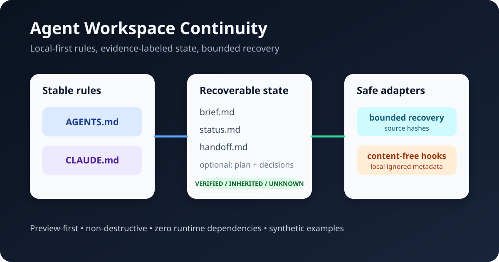

# Agent Workspace Continuity

**Local-first, evidence-labeled continuity for Claude Code, Codex, and other coding agents.**

AWC gives each workspace a small, auditable source of truth so a new agent session can recover the objective, verified state, unresolved risk, and next action without treating chat history as proof.



[](#verification)
[](pyproject.toml)
[](pyproject.toml)
[](LICENSE)
[](CHANGELOG.md)

## Why this exists

Coding agents often fail across sessions for predictable reasons:

- instructions, current state, and old assumptions are mixed together;
- inherited claims silently become “verified” facts;
- broad workspace roots trigger unnecessary scans and context pollution;
- handoffs are written only in chat and disappear from the next tool;
- hooks store raw prompts or responses and create a new privacy problem;
- setup scripts overwrite files that already belong to the project.

AWC addresses these failure modes with a deliberately small protocol rather than a proprietary memory service.

## Core model

```text
Stable rules                       Recoverable state
AGENTS.md                          .agent/brief.md
CLAUDE.md  -> imports AGENTS.md    .agent/status.md
                                   .agent/handoff.md
Optional                           Local, ignored state
.agent/plan.md                     .agent/local/
.agent/decisions.md                .agent/logs/
                                   .agent/backups/
                                   .agent/runtime-snapshot.json
```

Two profiles are included:

| Profile | Use it when | Key rule |
|---|---|---|
| `project` | One repository or one tightly scoped working directory | Work within the project and verify its source state |
| `umbrella` | One coordination root contains several independent child workspaces | Do not recursively scan; choose the smallest relevant child first |

## Installation

Python 3.11 or newer is required. Runtime dependencies: none.

```bash
python -m pip install agent_workspace_continuity-0.1.0-py3-none-any.whl
awc --version
```

For source development:

```bash
python -m pip install -e .
```

## Safe start

`init` is preview-only unless `--apply` is present:

```bash
awc init ./my-project --profile project
awc init ./my-project --profile project --apply
awc doctor ./my-project --strict
awc recover ./my-project
```

Add optional planning files and Claude Code hook examples:

```bash
awc init ./my-project \
  --profile project \
  --include-optional \
  --with-claude-hooks \
  --apply
```

The installer never replaces unrelated existing content. It writes a proposed version under `.agent/local/proposals/` and returns exit code `2` when manual merging is required.

## CLI

| Command | Purpose | Writes by default? |
|---|---|---:|
| `awc init` | Preview or install the scaffold | No; requires `--apply` |
| `awc doctor` | Validate structure, freshness, evidence labels, and privacy | No |
| `awc recover` | Produce a bounded recovery brief with source hashes | No, unless `--output` |
| `awc handoff` | Write an explicit structured handoff and back up the previous one | Yes |
| `awc snapshot` | Store privacy-minimized Git/runtime counts | Yes, unless `--stdout` |
| `awc privacy` | Scan public text for common secrets, user paths, and template residue | No |

Example handoff:

```bash
awc handoff . \
  --objective "Ship the parser after fixture-license review" \
  --verified "Unit tests pass on Python 3.13" \
  --changed "Added deterministic parser fixtures" \
  --blocker "Fixture license remains unverified" \
  --next "Review the fixture license" \
  --validation "python -m pytest -q"
```

## Evidence labels

`status.md` is intentionally divided into:

1. **Verified this session** — checked against files, commands, tests, or authoritative sources now.
2. **Existing, not re-verified** — inherited from an earlier session or source but not checked now.
3. **Unknowns and risks** — missing evidence, ambiguity, assumptions, and unresolved boundaries.

This prevents a common continuity failure: repeatedly copying an old claim until it appears authoritative.

## Optional Claude Code hooks

The opt-in hook example:

- injects a bounded navigation summary on `SessionStart`;
- logs only length and SHA-256 prefixes for compaction and stop events;
- stores no raw prompt, summary, or assistant message;
- emits no Stop decision and therefore does not ask Claude to continue;
- sanitizes event source and reason to known enum values;
- fails open so continuity metadata cannot block a coding session.

The example settings file is not activated automatically. Review and merge it into the appropriate Claude settings file yourself. See [Claude Code hooks](docs/claude-code-hooks.md).

## Synthetic examples

- [`examples/synthetic_project`](examples/synthetic_project) — fictional “Orbit Notes” parser project.
- [`examples/synthetic_umbrella`](examples/synthetic_umbrella) — fictional “Studio Hub” coordination root with independent child folders.

Both examples contain only synthetic names and data.

## Verification

The release gate runs:

```bash
python -m pytest -q
python scripts/validate_release.py
python scripts/build_release.py
```

Validated behaviors include:

- preview-first and non-destructive installation;
- re-installation across changing timestamps;
- profile-switch conflict protection;
- evidence boundary and stale-state checks;
- secret and personal-path scanning;
- deterministic bounded recovery;
- collision-safe handoff backups;
- privacy-minimized snapshots;
- content-free hook logs and fail-open behavior;
- CLI exit status contracts;
- deterministic Wheel and source archives.

See [release verification](docs/release-verification.md) for the exact public-release evidence.

## Architecture and limits

- [Architecture](docs/architecture.md)
- [Evidence model](docs/evidence-model.md)
- [Threat model](docs/threat-model.md)
- [Design decisions](docs/design-decisions.md)
- [Migration guide](docs/migration.md)
- [Compatibility](docs/compatibility.md)

AWC does **not** make Markdown instructions enforceable security policy, automatically prove agent claims, replace Git, back up a project, or synchronize state between machines. It makes state smaller, better labeled, easier to verify, and safer to hand off.

## License

MIT. See [LICENSE](LICENSE).
