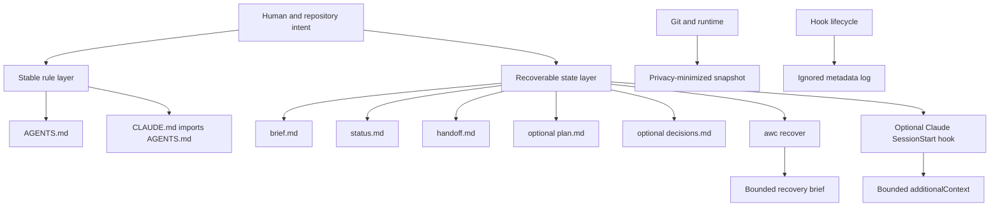

# Architecture

## Design target

AWC preserves the smallest useful continuity boundary across coding-agent sessions without introducing a server, database, account, or proprietary state format.

## Layered model

## Components

### 1. Stable rule layer

`AGENTS.md` contains cross-agent project rules. `CLAUDE.md` is deliberately thin and imports `AGENTS.md`, avoiding duplicated instructions that drift independently.

### 2. Recoverable state layer

`.agent/` separates durable context by function:

- `brief.md`: purpose, scope, constraints, and acceptance criteria;
- `status.md`: current objective plus evidence labels;
- `handoff.md`: the last verified state and next exact action;
- `plan.md`: optional active multi-step work;
- `decisions.md`: optional durable decisions, not a chronological diary.

### 3. Local ignored layer

`.agent/local/`, `.agent/logs/`, `.agent/backups/`, and `.agent/runtime-snapshot.json` are ignored. They may contain machine-local operational metadata but should still avoid raw prompts, responses, or credentials.

### 4. CLI

The CLI is a zero-runtime-dependency Python package:

- `init`: preview or install;
- `doctor`: validate structure and evidence discipline;
- `recover`: read a fixed source order and emit a bounded brief;
- `handoff`: write explicit state and back up the previous handoff;
- `snapshot`: capture counts and hashes without names or absolute paths;
- `privacy`: scan public text for common leakage patterns.

### 5. Optional hook adapter

The standalone Claude Code hook reads only the fixed continuity files. It does not recursively inspect the repository and does not require the Python package to remain installed after scaffolding.

## Fixed source order

Recovery uses this order:

1. `AGENTS.md`
2. `.agent/brief.md`
3. `.agent/status.md`
4. `.agent/handoff.md`
5. `.agent/plan.md`, when present
6. `.agent/decisions.md`, when present

Handoff has priority for current objective and immediate action. Status remains the broader evidence ledger.

## Failure behavior

- Installation conflicts never overwrite the target.
- Missing required state is surfaced in `doctor` and recovery notes.
- Hook failures return success with empty output so metadata cannot block the session.
- Stop hooks never emit a continuation decision.
- Privacy findings produce a failing CLI exit status.
